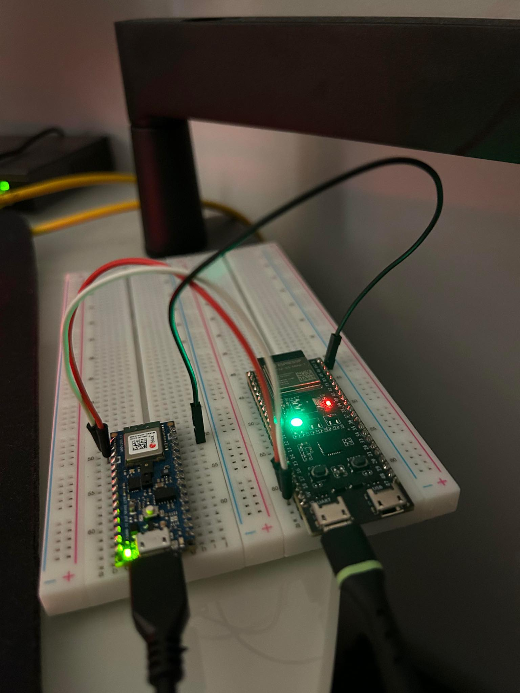
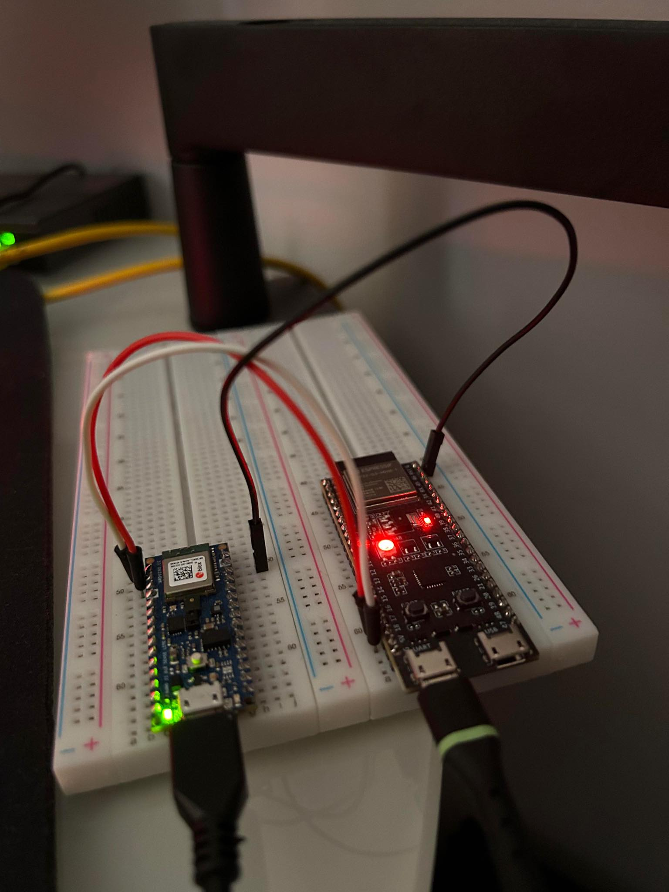
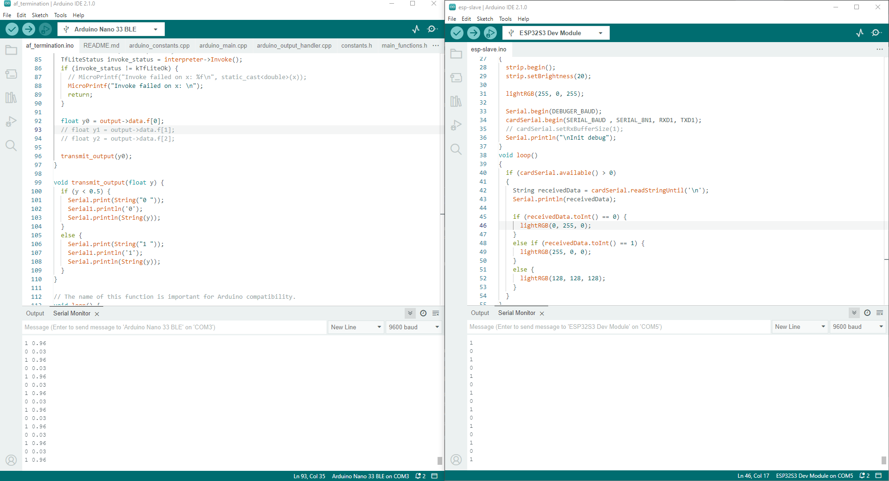

# Edge devicies

To implement neural network on edge device, I used arduino nano 33 BLE Sense Lite. For the slave device I used ESP32.

## Output

### Normal heart beat

### AF termination

### Serial port example

