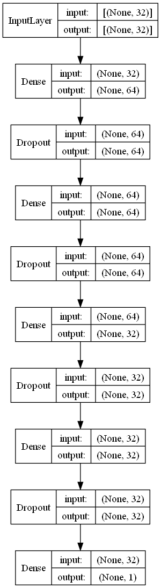
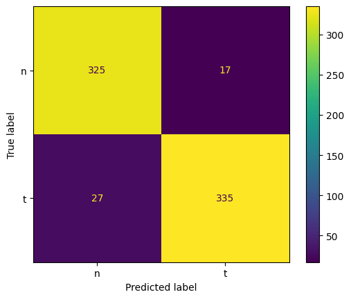

# Atrial fibrillation termination - neural network

In this project, I developed a simple binary classifier that detects whether an ECG signal is arterial fibrillation or not.

## Model architecture

The network architecture is a simple feed forward network with a single input. Model takes an ecg signal, 32 elements vector, and outputs the probability of AF termination.

```bash
Model: "sequential_108"
_________________________________________________________________
 Layer (type)                Output Shape              Param #   
=================================================================
 dense_636 (Dense)           (None, 64)                2112      
                                                                 
 dropout_95 (Dropout)        (None, 64)                0         
                                                                 
 dense_637 (Dense)           (None, 64)                4160      
                                                                 
 dropout_96 (Dropout)        (None, 64)                0         
                                                                 
 dense_638 (Dense)           (None, 32)                2080      
                                                                 
 dropout_97 (Dropout)        (None, 32)                0         
                                                                 
 dense_639 (Dense)           (None, 32)                1056      
                                                                 
 dropout_98 (Dropout)        (None, 32)                0         
                                                                 
 dense_640 (Dense)           (None, 1)                 33        
                                                                 
=================================================================
Total params: 9,441
Trainable params: 9,441
Non-trainable params: 0
_________________________________________________________________
```



## Performance

The model achived an accuracy of 93% on the test set.



## TF Lite conversion

Original model size: 162 KB

Converted model size: 40 KB
