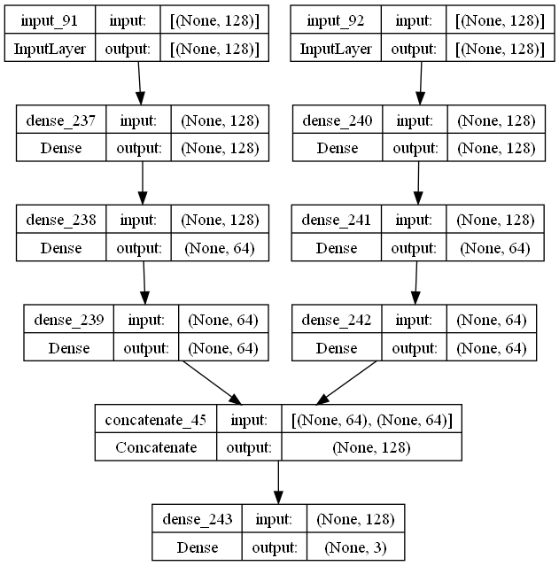

# Atrial fibrillation termination - neural network

TODO - brief description

## Model architecture

TODO - architecture description

## Performance

TODO - conf matrix, etc.

## TF Lite conversion

TODO - size before and after conversion
